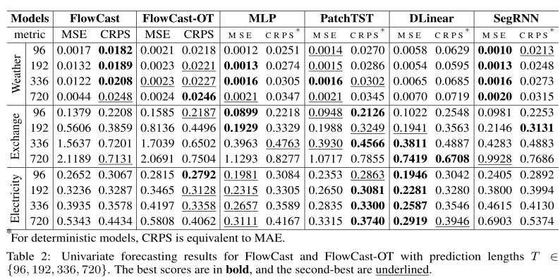
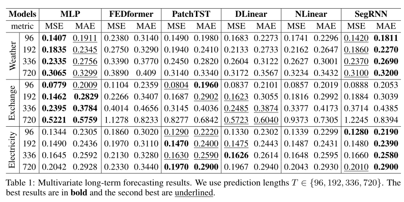

# FlowCast: Conditional Flow Matching for Probabilistic Time Series Forecasting

This repository contains the **PyTorch** implementation of the thesis:  
**"FlowCast: Conditional Flow Matching for Probabilistic Time Series Forecasting"**  

**African Institute of Mathematical Sciences (AIMS) Senegal**  
**Author:** Ahmed Abdalla  
**Supervisor:** Romain Menegaux  

## Features
- **FlowCast**: A generative Conditional Flow Matching (CFM) model tailored for Long-Term Time Series Forecasting (LTSF).  
- **FlowCast-OT**: Variant trained with a mini-batch Optimal Transport (OT) objective.  
- **MLP Baseline**: A simple yet strong MLP-based forecaster with stacked linear layers for learning abstract temporal representations.  
- **Efficiency**: Linear scaling w.r.t. context and prediction lengths by avoiding self-attention, recurrence, and convolution.   
- **Reproducibility**: Ready-to-use training scripts and baselines for quick experimentation.

This code is built on the code base of [Autoformer](https://github.com/thuml/Autoformer) and [LSTF-Linear](https://github.com/cure-lab/LTSF-Linear).


In addition to our models, we provide re-implementations of the **[NLinear and DLinear](https://arxiv.org/pdf/2205.13504.pdf)** (AAAI 2023) models for fair comparison.


## FlowCast

### FlowCast Models
FlowCast is a **lightweight generative Conditional Flow Matching (CFM)** model designed for the Long-term Time Series Forecasting (LTSF) task.

- **FlowCast**: The basic model, trained with **(MSE)** loss.
- **FlowCast-OT**: A variant of FlowCast trained with a **mini-batch Optimal Transport (OT)** objective to encourage smoother, simpler flows. Shares the same architecture as FlowCast.


We also provide implementations of a competitive baselinee for comparison:

- **MLP Baseline**: A simple yet effective multi-layer perceptron.  
  To enhance the expressiveness of the basic linear formulation, multiple linear layers are stacked, allowing the model to learn more abstract temporal representations. Each layer performs independent temporal transformations on each input feature, effectively treating each variate separately.


## Comparison with Baselines
### Univariate Forecasting:



### Multivariate Forecasting:




## Getting Started
### Environment Setup
First, ensure you have [Conda](https://docs.conda.io/en/latest/) installed.  
Then create and activate a new environment:

```bash
conda create -n flowcast python=3.9
conda activate flowcast
pip install -r requirements.txt
```


### 📂 Data Preparation

You can obtain all datasets from [Google Drive](https://drive.google.com/drive/folders/1ZOYpTUa82_jCcxIdTmyr0LXQfvaM9vIy).  
All datasets are **preprocessed** and ready for use.

Create a `dataset` directory and place the downloaded files inside:

```bash
mkdir dataset
```
### Training Example

Implementations for **FlowCast**, **FlowCast-OT**, **MLP**, **DLinear**, and **NLinear** are provided under `scripts/`.

**Train FlowCast on the Weather dataset:**
```bash
sh scripts/FlowCast/weather.sh
```

This command starts training and writes results to the `logs/` directory by default.
To run a different model, edit the script to set the desired model name (FlowCast, FlowCast-OT, MLP, DLinear, NLinear).

## Evaluation Metrics

We evaluate models using:

- **Mean Squared Error (MSE)**
- **Mean Absolute Error (MAE)**
- **Continuous Ranked Probability Score (CRPS)**


